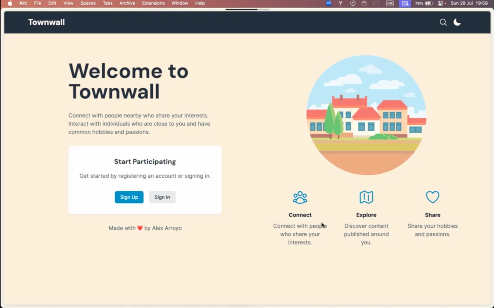

# Townwall

Townwall is a social platform designed to help users connect locally through shared interests. It enables users to create and share posts, follow other users, and interact through comments, all while discovering people nearby.

## Features

- **User Authentication**

  - Secure sign-up, log-in, and log-out functionalities.
  - Passwords hashed using bcrypt.
  - Input validation with Zod.
  - Session management with HTTP-only cookies.

- **User Profiles**

  - View and edit profiles, including profile images via Cloudinary integration.
  - Customize profiles with bios, interests, and random animal emojis.
  - Geolocation data captured and stored using HTML5 Geolocation API and PostgreSQL.

- **Posts**

  - Create, edit, and view posts with titles and content.
  - Assign categories to posts.
  - Search posts by username or location.
  - Display posts on user profiles.

- **Comments**

  - Comment on posts and user profiles.
  - Interactive public profiles or "Walls."

- **Follow System**

  - Follow and unfollow users.
  - API endpoint retrieves followers and following lists.

- **Geolocation**
  - Find and connect with nearby users.
  - Integration with Leaflet and PostGIS for geospatial queries.

## Tech Stack

## Live Preview

Check out the live app here: [Townwall App](https://townwall.fly.dev)

## Copyright

© 2024 Alex Arroyo
